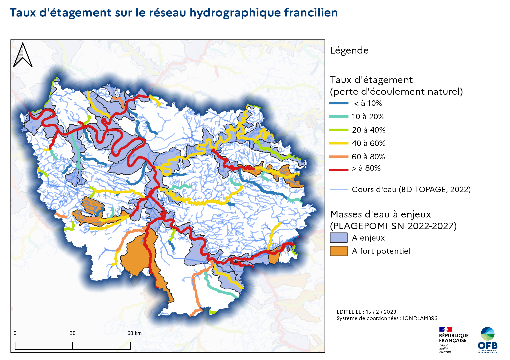

# La continuité écologique des cours d'eau

Le bon fonctionnement des écosystèmes liés aux cours d'eau dépend du maintien de leur connectivité longitudinale et transversale. Cette connectivité permet une bonne circulation des flux liquides, solides et biologiques entre les différents composants du paysage hydrographique.

Les obstacles à l'écoulement sont des ouvrages construits par l'homme pour répondre à des usages variés (production d'énergie, irrigation, soutien à la navigation, protection contre les innondations...). Les ouvrages transversaux affectent principalement la composante longitudinale de la continuité écologique en limitant les flux sédimentaires, empêchant la libre circulation des espèces, notamment piscicoles, et pouvant modifier les équilibres quantitatifs et l'état qualitatif de l'eau.

## Contexte réglementaire

La préservation et la restauration de la continuité écologique des cours d'eau sont explicitement prises en compte dans plusieurs textes réglementaires:

-   La Directive européenne cadre sur l'eau (DCE) [@noauthor_directive_2000] prévoit que, en lien avec l'objectif d'atteinte du bon état écologique de leurs masses d'eau, les États membres doivent garantir la continuité des cours d'eau;

-   La loi sur l'eau et les milieux aquatiques [@noauthor_loi_2006] transpose en droit français la DCE et courve la mise en place de dispositifs permettant la libre circulation et des débits minimums adaptés aux besoins écologiques.

Ainsi, en application de l'article [L.214-17 du code de l'environnement](https://www.legifrance.gouv.fr/codes/article_lc/LEGIARTI000043975402/2022-04-18), les cours d'eau ont été classés sur deux listes.

La liste 1 correspond à des cours d'eau en bon état écologique ou identifiés par le SDAGE comme jouant le rôle de réservoir biologique au niveau du bassin versant. Sur les cours d'eau classés à ce titre, aucune autorisation ou concession ne peut être accordée pour la construction de nouveaux ouvrages.

La liste 2 correspond à des cours d'eau dans lesquels il est nécessaire d'assurer le transport suffisant des sédiments et la circulation des poissons migrateurs. Sur les cours d'eau classés à ce titre les ouvrages doivent permettre ces transports via des actions de gestion, équipement ou destruction.

Les cours d'eau peuvent être classés sur l'une, l'autre ou les deux listes.

Ce cadre réglementaire est décliné opérationnellement dans des outils de gestion dont:

-   le [Schéma directeur d'aménagement et de gestion des eaux (SDAGE) 2022-2027](https://www.eau-seine-normandie.fr/domaines-d-action/sdage) du bassin Seine-Normandie définit des orientations de gestion parmi lesquelles la restauration de la continuité écologique en privilégiant les actions permettant de manière conjointe d'améliorer le libre écoulement de l'eau, le transit sédimentaire et la libre circulation des organismes;

-   le [Plan de gestion des poissons migrateurs (PLAGEPOMI)](https://www.drieat.ile-de-france.developpement-durable.gouv.fr/poissons-migrateurs-le-plan-de-gestion-2022-2027-a4632.html) du bassin Seine-Normandie définit des orientations de gestion plus spécifiquement ciblées pour favoriser la restauration des populations de poissons migrateurs.

## Etat des lieux

La connaissance de la continuité longitudinale des cours d'eau passe par la description des ouvrages transversaux pouvant l'entraver.

Cette connaissance peut ensuite être synthétisée sous la forme d'indicateurs qui sont utilisés pour piloter le suivi de politiques de restauration de la continuité des cours d'eau. Le SDAGE et le PLAGEPOMI fixent ainsi comme objectif de ramener la valeur de l'un de ces indicateurs, le taux d'étagement, sous le seuil de 30% pour les masses d'eau définies comme étant à enjeu pour les poissons migrateurs.

> **Taux d'étagement**: Rapport entre la somme des hauteurs de chute des obstacles à l'écoulement et le dénivelé naturel des cours d'eau

## Actions de l'OFB
